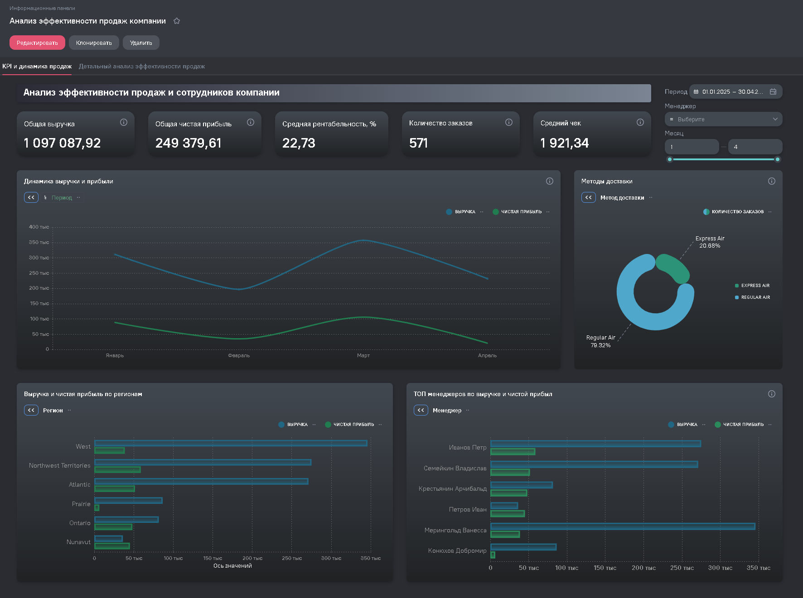
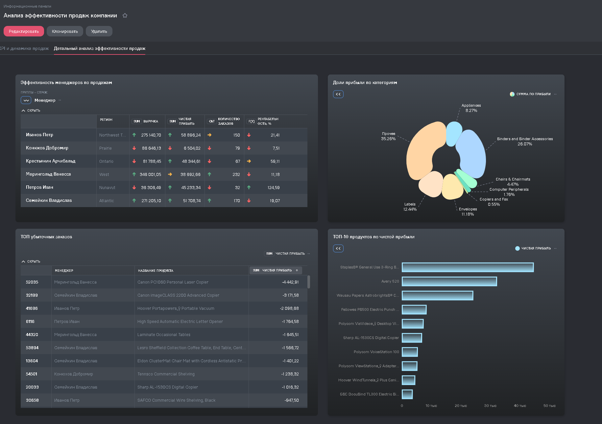

# 📊 BI-дашборд продаж — Analytic Workspace

Интерактивный двухстраничный BI-дашборд в Analytic Workspace: анализ продаж, эффективность менеджеров, KPI.

## 📌 О проекте

Интерактивный двухстраничный BI-дашборд в **Analytic Workspace BI** для анализа эффективности продаж и оценки результатов менеджеров компании.

Проект выполнен в рамках курса по Business Intelligence — полный цикл от модели данных до интерактивных визуализаций.

## 🎯 Исследовательские вопросы

1. Какова динамика выручки и чистой прибыли по месяцам?
2. Какие регионы приносят наибольшую выручку?
3. Кто из менеджеров наиболее эффективен по прибыли и рентабельности?
4. Какие товарные категории дают наибольшую долю прибыли?
5. Какие заказы убыточны и почему?

## 🔑 Ключевые выводы

- Пик выручки — март, после наблюдается снижение
- Иванов Петр лидирует по выручке (275к), Крестьянин Арчибальд — по рентабельности (59%)
- Binders and Binder Accessories доминируют в структуре прибыли (26%)
- Выявлено 10 убыточных заказов — максимальный убыток −4 443 руб. (Canon PC1080)
- Средняя рентабельность по компании — 22.73%

## 📊 Структура дашборда

**Страница 1 — KPI и динамика продаж**
- 5 KPI карточек: выручка, чистая прибыль, рентабельность, заказы, средний чек
- Динамика выручки и прибыли по месяцам
- Выручка и прибыль по регионам
- ТОП менеджеров по выручке и прибыли
- Методы доставки (Express Air vs Regular Air)

**Страница 2 — Детальный анализ**
- Эффективность менеджеров: выручка, прибыль, заказы, рентабельность
- Доли прибыли по категориям товаров
- ТОП-10 продуктов по чистой прибыли
- ТОП убыточных заказов

## 🔗 Интерактивный дашборд

[Открыть дашборд →](https://aw-demo.ru/public/dashboard/gAumA7zm7KH8-KM-KNaF3ROx59YtH0Bt?viewId=aa885853-e6cc-42c7-bc0c-81bd682ccdf3)

## 📸 Скриншоты

### Страница 1 — KPI и динамика


### Страница 2 — Детальный анализ


## 🛠️ Технологии

| Инструмент | Применение |
|---|---|
| Analytic Workspace BI | Платформа разработки |
| ETL / Data Modeling | Подготовка и связка данных |
| Calculated Fields | Рентабельность, средний чек |
| Calculated Aggregates | Агрегаты по менеджерам |
| Interactive Filters | Период, менеджер, месяц |
| SQL (Spark SQL) | CASE WHEN, CAST, очистка данных |

## 📁 Структура репозитория

```
aw-sales-dashboard/
├── README.md
├── images/                    # скриншоты дашборда
│   ├── dashboard_page_1.png
│   └── dashboard_page_2.png
└── data/
    └── Эффективность сотрудников.xlsx
```

## 🧠 Что демонстрирует кейс
- BI-разработка полного цикла: модель данных → вычисляемые поля → интерактивный дашборд.
- Анализ прибыльности: выручка, рентабельность, убыточные заказы.
- Обработка данных в Analytic Workspace (Spark SQL: CASE WHEN, CAST).

## 👤 Автор
**Вячеслав Тихомиров** — BI / Data Analyst
📧 t-slava@mail.ru · Telegram: [@tih_slava](https://t.me/tih_slava) · [GitHub](https://github.com/t-slava-pro)
